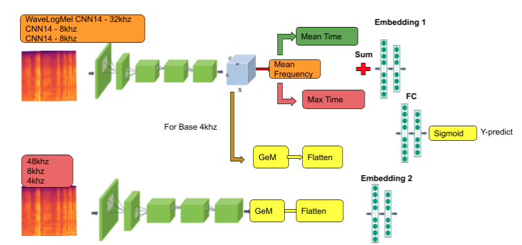

# Top 1 AICovid Cough VietNam 2021 Challenge - Fruit AI
<p align="center">
 
<p align="center">

 ## 1. Setup Envs - Requirements
```
  # Using anaconda3
  conda create -n aicv115m python=3.6
  conda install pytorch=1.7.0 torchvision=0.8.1 torchaudio=0.7.0 cudatoolkit=10.1 -c pytorch
  !pip install -r "requirements.txt"
  %cd ./modules/pytorch-image-models/
  !pip install .
```
  
## 2. Directory & file structures
```
aicv115m_challenge_solution
│   .gitignore
│   README.md
│   requirements.txt
|   docker-compose.yml # file config env local for Docker
|   Dockerfile         # file setup library for Docker
│   process.py         # Basic prediction function for 1 file aduio
│   serve.py           # main script to start Flask API
│   main.py            # train - create old submission - create new submission
│
└───assert/
|   |   audio
|   |   metadata
│
└───data/ - datasets are saved here
│   │   aicv115m-data-desc.pdf
│   │   aicv115m_extra_public_1235samples
|   |   |--   extra_public_train_1235samples.csv
|   |   |--   new_1235_audio_files
|   |   
│   │   aicv115m_final_private_test
|   |   |--   private_test_sample_submission.csv
|   |   |--   private_test_audio_files
|   |   
│   │   aicv115m_final_public_test
|   |   |--   public_test_sample_submission.csv
|   |   |--   public_test_audio_files
|   |   
│   │   aicv115m_final_public_train
|   |   |--   public_train_medical_condition.csv
|   |   |--   public_train_metadata.csv
|   |   |--   public_train_audio_files
|   |   
|   |   new_submission
|   |   old_submission
│
└───weights/ - trained models are saved here
|   |   logs            # Chứa các weight new train từ model (Trước khi train khuyến cáo nên xóa các file trong đây)
│   │   1.OnlyModelBase # File chứa weights model 4khz-8khz-48khz Stage1
|   |   
│   |   OldPretrained   # File chứa weights pretrained của fruitai cho 4khz-8khz-48khz Stage2
|   |   |--   Hybrid_4hz_8hz   # Chứa các fold từ 0 - 4
|   |   |--   Hybrid_8hz_8hz   # Chứa các fold từ 0 - 4
|   |   |--   Hybrid_48hz_32hz # Chứa các fold từ 0 - 4
|   |   
|   |   PANNnets
|   |   |-- Cnn14_8k_mAP=0.416.pth
|   |   |-- Cnn14_16k_mAP=0.438.pth
|   |   |-- Cnn14_mAP=0.431.pth
|   |   |-- Wavegram_Logmel_Cnn14_mAP=0.439.pth
|   
└───configs/
│   │   __init__.py
│   │   ...
└───modules/
│   │   __init__.py
│   │   ...
|   |
└───scripts/ - command use for train, create submission, run service
│   │   run_train.sh      # Training
│   │   run_submission.sh # Tạo Submmission từ weights new
│   │   run_oldsubmission.sh # Tạo Old Submmission từ weights FruitAI
│   │   run_service.sh  
```
Một vài lưu ý quan trọng:
1. Cần chỉnh path folder dataset đúng với structure ở trên 
2. `main.py` bao gồm các func Training - Create New Submission - Create Old Submission 
3. Chú ý config `gpu-id` và `batch-size` của những những file: `Gem4hz.yaml` - `Gem4hz_CNN8hz.yaml` 
  `Gem8hz.yaml` - `Gem8hz_CNN8hz.yaml` - `Gem48hz.yaml` - `Gem48hz_Wave32hz.yaml` 

## 3. Training
<p align="center">
 
<p align="center">
  
Trước khi thực hiện training cần lưu ý vài bước:
1. Chỉnh GPU-id trong các file trong thư mục `./configs` (mặc định: `gpus: [0,1]` - Khuyến khích train multi gpu để đạt kết quả cao nhất)
   GPU: 1070 và 1080ti
2. Tùy vào memory gpu, chỉnh các batch-size phù hợp trong `run_train.sh`
3. Có thể tùy chỉnh K-folds bằng giá trị `NUM_FOLDS` trong file `run_train.sh` để có kết quả tốt hơn
4. Trước khi thực hiện train 2-stage cần xóa các folder trong `./weights/logs/` tránh bị miss
5. Download pretrained bỏ vào thư mục PANNnets theo như dường dẫn (https://zenodo.org/record/3987831)
6. Không tùy chỉnh các config của audio   
```bash
chmod +x scripts/run_train.sh
./scripts/run_train.sh
```
## 4. Create Old Submission
Đây là bước sẽ dụng các Old weights của team create submission
1. Download bộ pretrained của nhóm: contact oggyfaker@gmail.com
2. Tất cả các file csv của từng tần số khz đều xuất hiện trong foler `./data/old_submission`
3. File cuối cùng để submit là `results.csv`
```bash
%cd aicv115m_challenge_solution/
chmod +x scripts/run_oldsubmission.sh
./scripts/run_oldsubmission.sh
```
 
## 5. Create New Submission
Đây là bước sẽ dụng các New weights để create submission
1. Tùy vào K-fold đã sữ dụng training phải , set NUM_FOLDS giống NUM_FOLDS đã train
2. Thay đổi các giá trị `NewAlpha` trong `Gem4hz_CNN8hz.yaml` `Gem8hz_CNN8hz.yaml` `Gem48hz_Wave32hz.yaml` 
2. Tất cả các file csv của từng tần số khz xuất hiện trong foler `./data/new_submission`
3. File cuối cùng để submit là `results.csv` 
```bash
%cd aicv115m_challenge_solution/
chmod +x scripts/run_submission.sh
./scripts/run_submission.sh
```

## 6. Build and run with Docker
Đây là bước khởi tạo flask api (Bắt buộc phải có GPU)
1. Chỉnh GPU-id trong `docker-compose.yml`
```bash
%cd aicv115m_challenge_solution/
chmod +x ./scripts/run_service.sh
./scripts/run_service.sh
```
